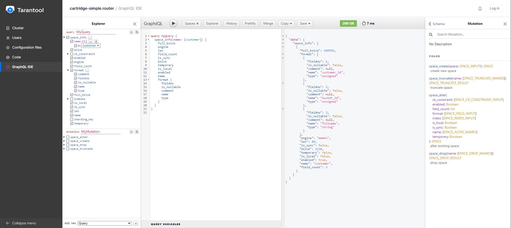

# GraphQLAPI Tarantool Cartridge-based application simple example

This Example shows simple and quite easy way of howto use set of modules in application:

- [Tarantool GraphQLIDE 0.0.20+](https://github.com/tarantool/graphqlide)
- [Tarantool GraphQLAPI 0.0.8+](https://github.com/tarantool/graphqlapi)
- [Tarantool GraphQLAPI Helpers 0.0.8+](https://github.com/tarantool/graphqlapi-helpers) - this particular module available only in Tarantool Enterprise SDK bundle

## Quick start

To build application, start it and setup topology:

```bash
# build application
cartridge build

# start all instances including stateboard
cartridge start -d

# configure replicasets and bootstrap vshard
cartridge replicasets setup --bootstrap-vshard

# configure failover
cartridge failover setup --file failover.yml
```

or use bash-scripts:

```bash
# install dependencies
./deps.sh

# build and start application
./scripts/start.sh

# bootstrap cluster and failover
./scripts/bootstrap.sh
```

Now you can visit http://localhost:8081 and see your application's Admin Web UI.

**Note**, that application stateboard is always started by default.
See [`.cartridge.yml`](./.cartridge.yml) file to change this behavior.

## Application

Application entry point is [`init.lua`](./init.lua) file.
It configures Cartridge, initializes admin functions and exposes metrics endpoints.
Before requiring `cartridge` module `package_compat.cfg()` is called.
It configures package search path to correctly start application on production
(e.g. using `systemd`).

## Roles

Application has two simple roles:

- [`app.roles.api`](./app/roles/api.lua).
- [`app.roles.storage`](./app/roles/storage.lua)

Both `api` and `storage` roles exposes `/metrics` endpoints:

```bash
curl localhost:8081/metrics
```

### api role

Custom user `api` role uses the following Cartridge roles:

- cartridge.roles.vshard-router
- cartridge.roles.crud-router
- cartridge.roles.graphqlide
- cartridge.roles.graphqlapi

### storage role

Custom user `storage` role uses the following roles:

- cartridge.roles.vshard-storage
- cartridge.roles.crud-storage

## GraphqlIDE

After starting application on [`router` - http://localhost:8081](http://localhost:8081) instance GraphQL IDE will be available:



The following schemes are available in this demo application:

- `Data` - CRUD GraphQL API generated based on the current cluster data schema;
- `Spaces` - a set of queries and mutations to manipulate spaces.
